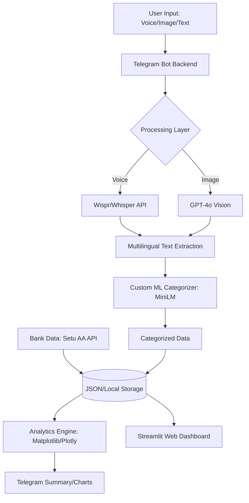

# 📊 FineHance Omni
### *The Frictionless, Multimodal Financial Intelligence Ecosystem*

[](LICENSE)
[](https://www.python.org/downloads/)
[](https://huggingface.co/CyberKunju/finehance-categorizer-minilm)

**FineHance Omni** is an all-in-one financial assistant that turns the chore of expense tracking into a seamless conversation. By combining **Voice**, **Vision**, **Custom Transformers**, and **Setu Account Aggregator**, it captures every rupee of your spending with zero friction and provides professional-grade financial insights instantly.

---

## 🌟 The Problem
Most people stop tracking their finances because of **friction**. Opening an app, navigating menus, and typing "₹500 - Food" takes too long. Receipts get lost, voice notes are messy, and manual entry often misses bank-direct transactions (UPI/IMPS).

## ✅ The Solution
FineHance Omni removes the interface entirely. 
- **Talk to it:** Just like a friend (English, Hindi, Malayalam, Tamil, etc.).
- **Show it:** Snap a photo of a receipt.
- **Sync it:** Securely connect your Indian bank accounts via **Setu**.
- **See it:** Get professional analytics on your phone or a dedicated web dashboard.

---

## 🚀 Key Features

### 🎙️ 1. Voice-to-Finance (Powered by Wispr)
Don't type. Just say: *"Hey, I just spent 1200 on petrol at Shell."* 
FineHance Omni transcribes the audio, extracts the amount, and uses a specialized model to categorize it in milliseconds.

### 👁️ 2. Receipt Vision (GPT-4o)
Snap a photo of any thermal receipt or invoice. The system itemizes the entire purchase, extracting:
- Individual line items
- Total amount & Taxes
- Merchant name & Date

### 🧠 3. Custom ML Categorization
Unlike generic trackers, we use a specialized, fine-tuned **MiniLM-L6 Transformer** model:
- **Model:** `CyberKunju/finehance-categorizer-minilm`
- **Precision:** **96.56% Accuracy** across 23 distinct financial categories.
- **Latency:** Ultra-fast inference (~6,600 samples/sec).

### 🏦 4. Automated Indian Bank Sync (Setu)
Powered by the **Setu Account Aggregator** framework.
- **UPI Integration:** Automatically pulls transactions from HDFC, SBI, ICICI, etc.
- **Real-time Reconciliation:** Matches manual logs with bank-direct transactions.
- **Subscription Detection:** Identifies recurring "vampire" payments automatically.

### 🌍 5. South Indian Multilingual Support
Talk to the bot in your native language. We support:
- **Malayalam (മലയാളം)**
- **Tamil (தமிழ்)**
- **Telugu (తెలుగు)**
- **Kannada (ಕನ್ನಡ)**
- *English & Hindi (Standard)*

### 📊 6. Professional Visualization & Insights
- **In-Bot Charts:** Get instant Pie Charts directly in your Telegram chat via `/summary`.
- **AI Insights:** Proactive advice based on spending patterns.
- **Web Dashboard:** A real-time **Streamlit** command center for deep-dives and historical tracking.

---

## 🛠️ Technical Architecture



---

## 🏗️ Development Division
This project is built using a collaborative agent-based approach:
- **Backend & Logic (This Repo):** Full Telegram Bot implementation, API integrations (Wispr, Setu, OpenAI), and Custom ML pipeline.
- **UI/UX:** Specialized UI agent focused on the Web Dashboard and Visual Identity.

---

## 🏷️ Supported Categories (23)
`Bills & Utilities` • `Cash & ATM` • `Childcare` • `Coffee & Beverages` • `Convenience` • `Education` • `Entertainment` • `Fast Food` • `Food Delivery` • `Gas & Fuel` • `Giving` • `Groceries` • `Healthcare` • `Housing` • `Income` • `Insurance` • `Other` • `Restaurants` • `Shopping & Retail` • `Subscriptions` • `Transfers` • `Transportation` • `Travel`

---

## ⚡ Quick Start

### 1. Clone & Install
```bash
git clone https://github.com/Dawn-Fighter/finehance-omni.git
cd finehance-omni
pip install -r requirements.txt
```

### 2. Configure Credentials
Create a `.env` file in the root directory:
```env
OPENAI_API_KEY=your_key_here
LLM_MODEL=gpt-4o
TELEGRAM_BOT_TOKEN=your_token_here
HF_TOKEN=your_hf_token_here
SETU_CLIENT_ID=your_setu_id
SETU_CLIENT_SECRET=your_setu_secret
SETU_PRODUCT_INSTANCE_ID=your_instance_id
```

### 3. Run the Ecosystem
**Start the Bot Backend:**
```bash
python bot/bot.py
```
**Start the Dashboard:**
```bash
streamlit run dashboard/app.py
```

---

## 🏆 Hackathon Context
**FineHance Omni** was conceptualized, built, and deployed in **8 hours**. It demonstrates the power of combining specialized custom ML models with multimodal LLM capabilities and Indian financial APIs (Setu) to solve a real-world utility problem.

---

## 👨‍💻 Authors
**Kashyap Dayal**  
**Navaneeth K (CyberKunju)**  
**Chethas Dileep**

[Hugging Face Profile](https://huggingface.co/CyberKunju) | [GitHub](https://github.com/Dawn-Fighter)
