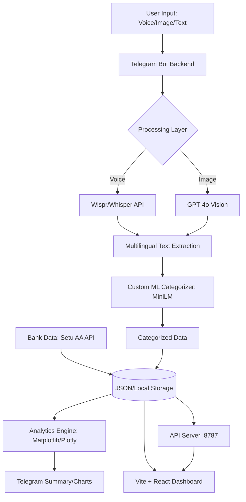

<div align="center">

# 🌌 FineHance Omni
### The Frictionless, Multimodal Financial Intelligence Ecosystem

[](LICENSE)
[](https://www.python.org/downloads/)
[](https://reactjs.org/)
[](https://vitejs.dev/)
[](https://huggingface.co/CyberKunju/finehance-categorizer-minilm)

*FineHance Omni* is a next-generation financial assistant designed to completely eliminate the friction of expense tracking. By uniting *Voice Automation, **Receipt Vision, a **Custom Transformer Model, **Setu Open Banking, and a **Stunning Modern Web Dashboard*, it captures every rupee of your spending with zero effort and provides proactive, professional-grade financial insights.

[Explore the Custom ML Model](https://huggingface.co/CyberKunju/finehance-categorizer-minilm) • [Report Bug](https://github.com/Dawn-Fighter/finehance-omni/issues) • [Request Feature](https://github.com/Dawn-Fighter/finehance-omni/issues)

</div>

## 🚀 Key Features

### 🎙️ 1. Voice-to-Finance (Powered by Wispr)
Don't type. Just say: *"Hey, I just spent 1200 on petrol at Shell."* 
FineHance Omni transcribes the audio, extracts the amount, and uses a specialized model to categorize it in milliseconds.

### 👁️ 2. Receipt Vision (GPT-4o)
Snap a photo of any thermal receipt or invoice. The system itemizes the entire purchase, extracting:
- Individual line items
- Total amount & Taxes
- Merchant name & Date

### 🧠 3. Custom ML Categorization
Unlike generic trackers, we use a specialized, fine-tuned **MiniLM-L6 Transformer** model:
- **Model:** `CyberKunju/finehance-categorizer-minilm`
- **Precision:** **96.56% Accuracy** across 23 distinct financial categories.
- **Latency:** Ultra-fast inference (~6,600 samples/sec).

### 🏦 4. Automated Indian Bank Sync (Setu)
Powered by the **Setu Account Aggregator** framework.
- **UPI Integration:** Automatically pulls transactions from HDFC, SBI, ICICI, etc.
- **Real-time Reconciliation:** Matches manual logs with bank-direct transactions.
- **Subscription Detection:** Identifies recurring "vampire" payments automatically.

### 🌍 5. South Indian Multilingual Support
Talk to the bot in your native language. We support:
- **Malayalam (മലയാളം)**, **Tamil (தமிழ்)**, **Telugu (తెలుగు)**, **Kannada (ಕನ್ನಡ)**, *English & Hindi*

### 💰 6. Wallet & Account Tracking
Track money across multiple wallets — cash, bank accounts, UPI, credit cards.
- `/wallet cash 5000` — Create a wallet with an initial balance
- `/balance` — View all wallet balances at a glance
- `/transfer cash hdfc 3000` — Move money between wallets
- Every expense auto-deducts from the correct wallet

### 🤝 7. Lending & Borrowing Ledger
Never forget who owes whom.
- `/lend John 500 dinner` — Record money you lent
- `/borrow Sarah 1000 tickets` — Record money you borrowed
- `/debts` — See all outstanding balances at a glance

### 📄 8. PDF Expense Reports
Generate professional PDF reports with charts and transaction tables.
- `/report` — Last 30 days (default)
- `/report 7` — Last 7 days
- Includes category breakdown bar chart + transaction table

### 🌳 9. Hierarchical Spending Summary
See your spending organized in a tree structure by parent category → subcategory.
- `/treesummary` — Beautiful tree-formatted breakdown
```
├── Food — ₹3,200
│   ├── Restaurants: ₹1,500
│   ├── Fast Food: ₹800
│   └── Groceries: ₹900
├── Transport — ₹2,100
│   ├── Travel: ₹1,400
│   └── Transportation: ₹700
└── Lifestyle — ₹749
    └── Subscriptions: ₹749
```

### 📊 10. Professional Visualization & Insights
- **In-Bot Charts:** Get instant Pie Charts directly in your Telegram chat via `/summary`.
- **AI Insights:** Proactive advice based on spending patterns.
- **Web Dashboard:** A real-time **Vite + React** command center with live data sync — every expense logged via the bot appears on the dashboard within seconds.

---

## 🛠️ Technical Architecture



---

## 🏗️ Development Division
This project is built using a collaborative agent-based approach:
- **Backend & Logic (This Repo):** Full Telegram Bot implementation, API integrations (Wispr, Setu, OpenAI), and Custom ML pipeline.
- **UI/UX:** Specialized UI agent focused on the Web Dashboard and Visual Identity.

---

## 🏷️ Supported Categories (23)
`Bills & Utilities` • `Cash & ATM` • `Childcare` • `Coffee & Beverages` • `Convenience` • `Education` • `Entertainment` • `Fast Food` • `Food Delivery` • `Gas & Fuel` • `Giving` • `Groceries` • `Healthcare` • `Housing` • `Income` • `Insurance` • `Other` • `Restaurants` • `Shopping & Retail` • `Subscriptions` • `Transfers` • `Transportation` • `Travel`

---

## 🤖 Bot Commands

| Command | Description |
|---------|-------------|
| `/start` | Start the assistant |
| `/help` | Show all commands |
| `/language` | Change bot language |
| `/summary` | Spending summary with chart |
| `/treesummary` | Hierarchical spending breakdown |
| `/insights` | AI financial insights |
| `/balance` | View wallet balances |
| `/wallet <name> [amount]` | Add a new wallet |
| `/transfer <from> <to> <amount>` | Transfer between wallets |
| `/lend <person> <amount> [note]` | Record money lent |
| `/borrow <person> <amount> [note]` | Record money borrowed |
| `/debts` | View outstanding debts |
| `/report [days]` | Generate PDF expense report |
| `/subscriptions` | View recurring expenses |
| `/setbudget <category> <amount>` | Set budget alerts |
| `/export` | Download expenses as CSV |
| `/stats` | View streaks and badges |
| `/reminders` | Toggle smart reminders |
| `/suggestions` | Spending suggestions per category |
| `/dashboard` | Open the web dashboard |

---

## ⚡ Quick Start

### 1. Clone & Install
```bash
git clone https://github.com/Dawn-Fighter/finehance-omni.git
cd finehance-omni
pip install -r requirements.txt
```

### 2. Configure Credentials
Create a `.env` file in the root directory:
```env
OPENAI_API_KEY=your_key_here
LLM_MODEL=gpt-4o
TELEGRAM_BOT_TOKEN=your_token_here
HF_TOKEN=your_hf_token_here
SETU_CLIENT_ID=your_setu_id
SETU_CLIENT_SECRET=your_setu_secret
SETU_PRODUCT_INSTANCE_ID=your_instance_id
```

### 3. Run the Ecosystem
**Start the Bot Backend:**
```bash
python bot/bot.py
```
**Start the API Server (for dashboard):**
```bash
python bot/api_server.py
```
**Start the Dashboard:**
```bash
cd frontend && npm install && npx vite
```

---

## 🏆 Hackathon Context
**FineHance Omni** was conceptualized, built, and deployed in **8 hours**. It demonstrates the power of combining specialized custom ML models with multimodal LLM capabilities and Indian financial APIs (Setu) to solve a real-world utility problem.

---

## 👨‍💻 Authors
**Kashyap Dayal**  
**Navaneeth K (CyberKunju)**  
**Chethas Dileep**

[Hugging Face Profile](https://huggingface.co/CyberKunju) | [GitHub](https://github.com/Dawn-Fighter)
