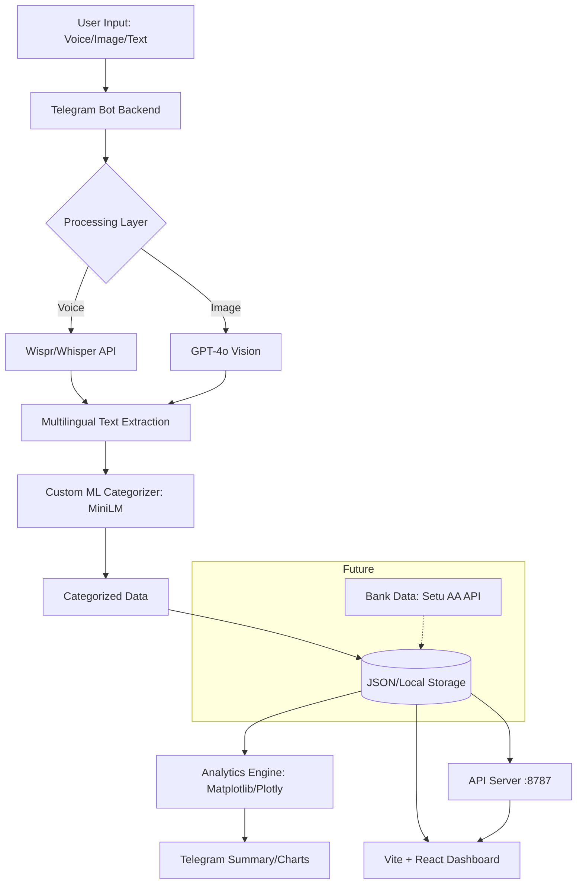

<div align="center">

# Requiem: FineHance Omni
### 🏆 **1st Place Winner (Track 1) — Vibe Athon**
**Vidyavardhaka College of Engineering, Mysore**

[](LICENSE)
[](https://www.python.org/downloads/)
[](https://reactjs.org/)
[](https://vitejs.dev/)
[](https://huggingface.co/CyberKunju/finehance-categorizer-minilm)

**FineHance Omni** is an advanced, multimodal financial intelligence ecosystem developed by **Team Requiem**. Designed to eliminate the friction of personal finance management, it integrates voice automation, receipt vision, and custom transformer models into a seamless, professional-grade dashboard.

[Explore the ML Model](https://huggingface.co/CyberKunju/finehance-categorizer-minilm) • [Report Bug](https://github.com/Dawn-Fighter/finehance-omni/issues) • [Request Feature](https://github.com/Dawn-Fighter/finehance-omni/issues)

</div>

---

## 🌟 Overview

FineHance Omni was engineered to solve the "tracking fatigue" that plagues traditional financial apps. By leveraging high-performance AI, we've built a system that captures every rupee with zero manual entry, providing users with actionable, proactive financial insights through natural language and vision.

## 🚀 Key Features

### 🎙️ 1. Voice-to-Finance (Wispr Powered)
Eliminate typing. Users can log expenses using natural language: *"Hey, I just spent 1200 on petrol at Shell."* The system performs real-time transcription, entity extraction, and automated categorization in milliseconds.

### 👁️ 2. Receipt Vision (GPT-4o)
Advanced OCR and document understanding for thermal receipts and invoices. The system automatically itemizes purchases, extracting merchant metadata, tax components, and individual line items with high precision.

### 🧠 3. Custom ML Categorization
Powered by a fine-tuned **MiniLM-L6 Transformer** model, ensuring enterprise-grade accuracy without the latency of general-purpose LLMs.
- **Model:** `CyberKunju/finehance-categorizer-minilm`
- **Performance:** **96.56% Accuracy** across 23 financial categories.
- **Efficiency:** Ultra-fast inference (~6,600 samples/sec).

### 🌍 4. Multilingual Intelligence
Full support for major South Indian languages, enabling inclusive financial tools for a diverse user base:
- **Malayalam, Tamil, Telugu, Kannada, Hindi, and English.**

### 💰 5. Comprehensive Asset Tracking
Manage liquidity across various modalities — cash, UPI, bank accounts, and credit cards.
- Multi-wallet support with real-time balance tracking.
- Inter-wallet transfers and automated balance adjustment.

### 🤝 6. Lending & Debt Ledger
A centralized system to manage social lending and borrowing.
- Detailed records of outstanding debts and credits.
- Instant overview of "who owes what" via `/debts`.

### 📄 7. Professional Financial Reporting
Generate audit-ready PDF reports featuring interactive charts and comprehensive transaction tables.
- Customizable timeframes (7-day, 30-day, or custom).
- Visual category breakdowns and spending trends.

### 📊 8. Real-time Analytics Dashboard
A high-performance **Vite + React** command center that synchronizes instantly with the Telegram bot. View spending hierarchies, AI-driven insights, and interactive visualizations.

---

## 🛠️ Technical Architecture



---

## 🗺️ Roadmap & Future Enhancements

- [ ] **Automated Banking Sync (Setu AA):** Full integration with the Setu Account Aggregator framework for secure, real-time access to Indian banking data (UPI Reconciliation & Vampire Payment Detection).
- [ ] **Smart Budgeting:** Proactive alerts when approaching category-specific limits.
- [ ] **Investment Tracking:** Integration with mutual fund and stock market APIs for a complete net-worth overview.

---

## 🏗️ Development Division
This project utilizes a collaborative agent-driven architecture:
- **Core Engine:** Backend logic, API orchestrations, and ML pipeline.
- **Visual Identity:** Specialized UI/UX focus for the Web Dashboard and data visualization.

---

## 🤖 Bot Commands

| Command | Description |
|---------|-------------|
| `/start` | Initialize the assistant |
| `/summary` | Visual spending summary with analytics |
| `/insights` | AI-driven financial advice |
| `/balance` | Current liquidity overview |
| `/report` | Generate professional PDF report |
| `/dashboard` | Access the web command center |

---

## ⚡ Quick Start

### 1. Installation
```bash
git clone https://github.com/Dawn-Fighter/finehance-omni.git
cd finehance-omni
pip install -r requirements.txt
```

### 2. Environment Setup
Configure your `.env` file with the necessary API keys:
```env
OPENAI_API_KEY=...
TELEGRAM_BOT_TOKEN=...
HF_TOKEN=...
```

### 3. Execution
**Backend:** `python bot/bot.py`  
**API Server:** `python bot/api_server.py`  
**Dashboard:** `cd frontend && npm install && npx vite`

---

## 🏆 Achievement: Vibe Athon (VVCE)
**FineHance Omni** was conceptualized, developed, and deployed in just **8 hours**, securing **1st Place in Track 1** at **Vibe Athon**, Vidyavardhaka College of Engineering. It stands as a testament to the power of specialized ML models and multimodal AI in solving complex real-world challenges.

---

## 👥 Authors (Team Requiem)
- **Kashyap Dayal**
- **Navaneeth K (CyberKunju)**
- **Chethas Dileep**

[Hugging Face Profile](https://huggingface.co/CyberKunju) | [GitHub](https://github.com/Dawn-Fighter)
